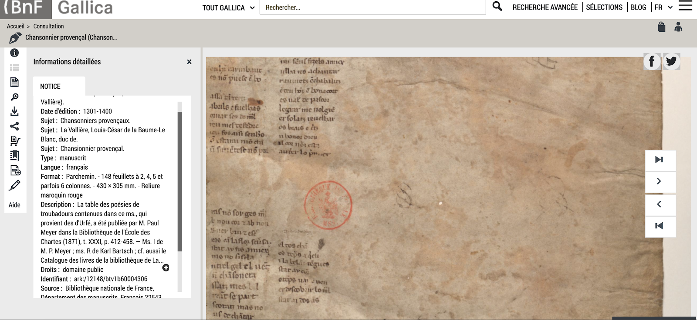

# Step 1. Analyse what already exist

Each of us explored a website, taking notice of features she loves and features she hates. We focused on digital editions and used the [Catalogue of Digital Editions](https://dig-ed-cat.acdh.oeaw.ac.at/) and the [Catalog of Digital Scholarly Editions](http://www.digitale-edition.de/) to find what we were looking for.

### What we love

#### **Megamenus**

Example [http://www.e-codices.unifr.ch/en](http://www.e-codices.unifr.ch/en), About \(in the topbar\).

Because it stores a lot of information, including the sections in pages; it is well structured, using bold and lines. And it does not disappear when moving the mouse.

#### **Tradition and innovation**

Example: New York Times [https://www.nytimes.com/](https://www.nytimes.com/).

Because it mixed elements similar to the paper edition \(font, position of the articles on the page\) with the mechanisms of the web \(multimodaliry, image carrousel, links\)

#### **Facsimile and transcription**

Example [https://www.bovary.fr/folio\_visu.php?folio=2951&mode=sequence&mot=](https://www.bovary.fr/folio_visu.php?folio=2951&mode=sequence&mot=).

Juxtaposition ms/transcription, considering spatial organisation and colors.

#### **Simple and intuitive navigation, organised information**

Example [https://gallica.bnf.fr/ark:/12148/btv1b53025633d](https://gallica.bnf.fr/ark:/12148/btv1b53025633d)

Easy zoom \(almost have the feeling of playing\), well structured information tab, possibility of show or hide elements easily depending on what the user wants.

Xanadu

Example: Présentation \(3 mins\): [https://www.youtube.com/watch?v=Bqx6li5dbEY](https://www.youtube.com/watch?v=Bqx6li5dbEY). Demo: [http://xanadu.com/xanademos/MoeJusteOrigins.html](http://xanadu.com/xanademos/MoeJusteOrigins.html).

Because it shows the links between the texts. But it is difficult to implement ...

### What we hate

#### **Changing fonts and font sizes in the same page**

Example: New York Times [https://www.nytimes.com/](https://www.nytimes.com/).

Example: The Zibaldone Project [https://www.birmingham.ac.uk/research/activity/leopardi/projects/index.aspx](https://www.birmingham.ac.uk/research/activity/leopardi/projects/index.aspx).

#### **Unclear menus**.

Which is the difference between the tabs?

Example: Les manuscrits de Madame Bovary [http://www.bovary.fr](http://www.bovary.fr).

#### **Hovering effects**. 

Windows opening and covering the rest of the page.

Example: L'âge d'homme [https://lagedhomme.com/](https://lagedhomme.com/).

#### **Academic homepages**. 

Homepage addressed to specialists with a cold and austere presentation.

Example: Jane Austen Fiction Manuscripts [https://janeausten.ac.uk/index.html](https://janeausten.ac.uk/index.html).

#### **Illegible URLs**.

Example: [https://dig-ed-cat.acdh.oeaw.ac.at/](https://dig-ed-cat.acdh.oeaw.ac.at/).

