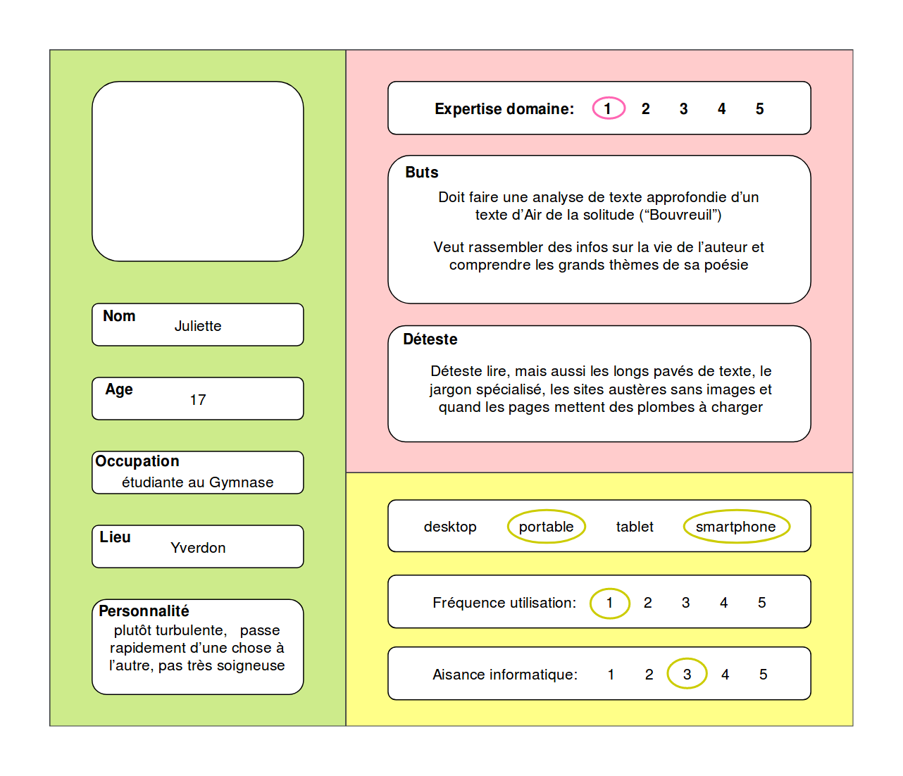
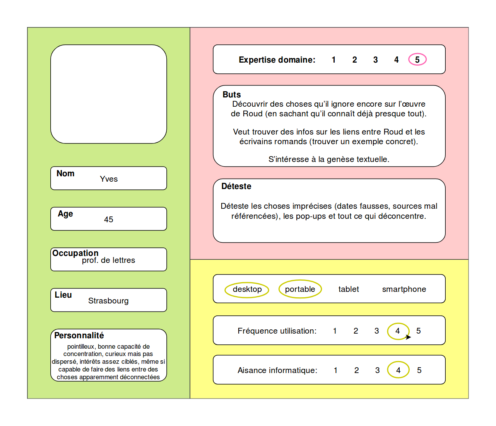
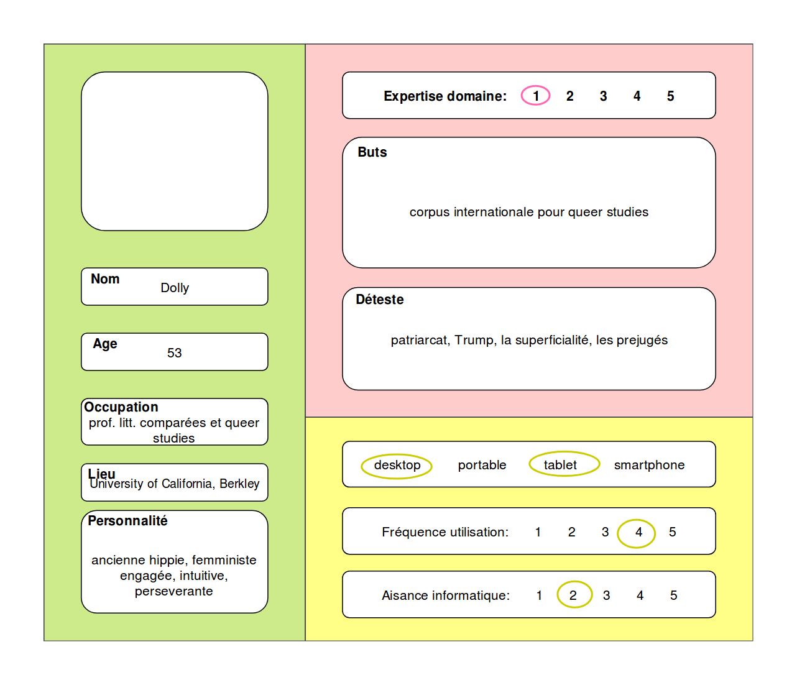
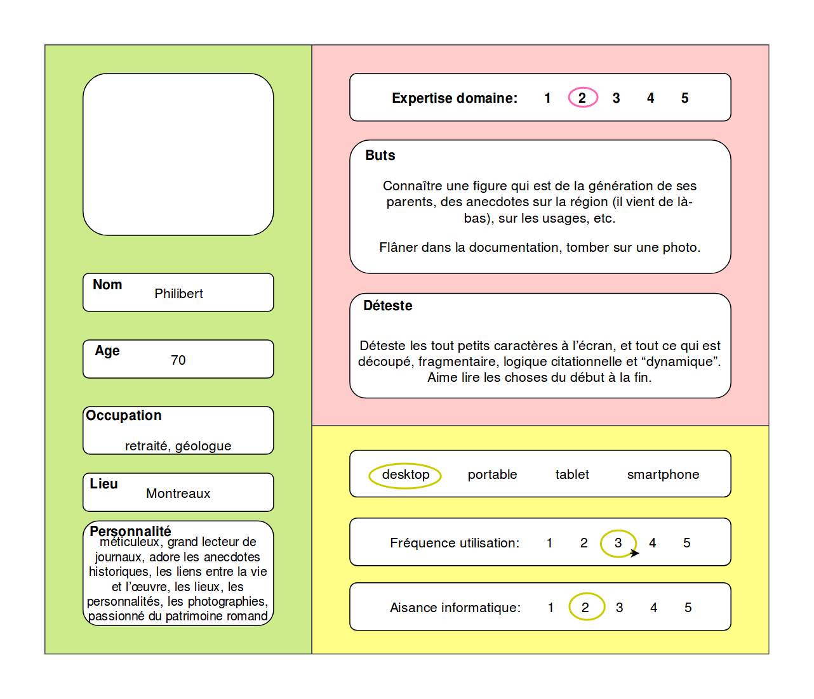
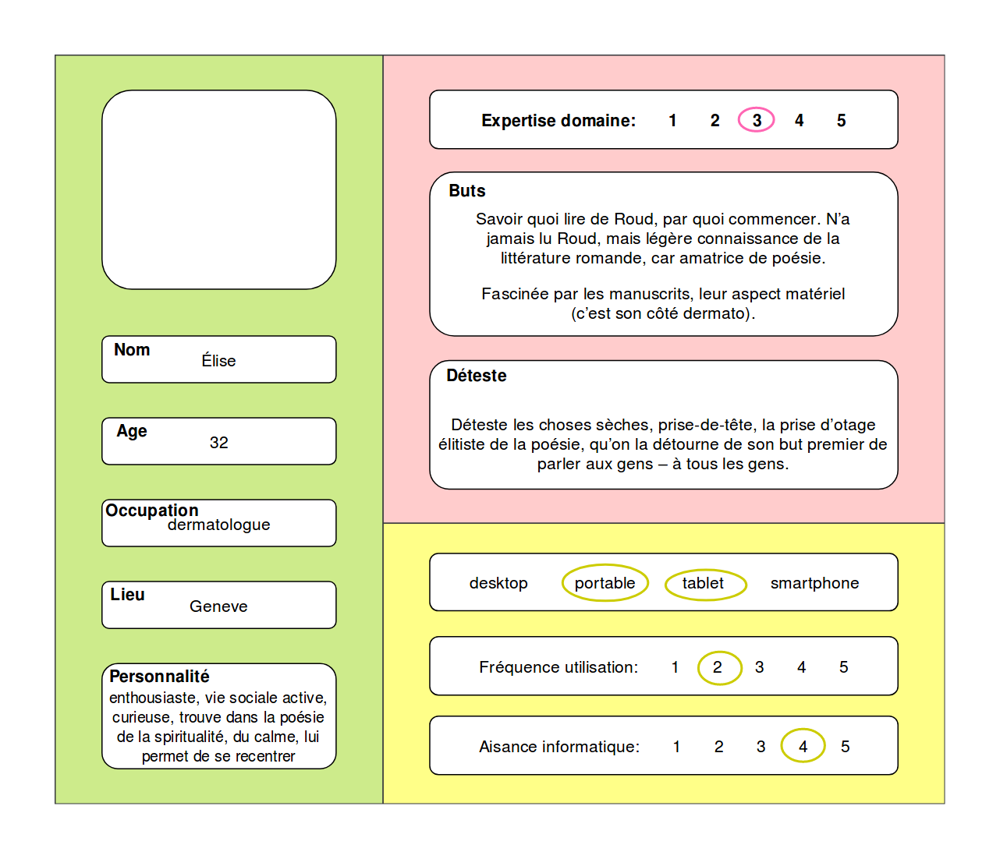

# Step 3. Stories and tasks

Each of our persons has a story, something that she or he wants to accomplish with our web application. To reach the goal, a series of tasks should be completed; the smallest the task, the better for the design.

Here it goes the result of steps 2 and 3. The original version include fake pictures of each person, but they can't be reproduced here. These materials are in French.

### **High-school students**

Juliette's first story:

> Travail de gymnase sur d’Air de la solitude \(“Bouvreuil”\). Cherche un résumé du livre, qu’elle n’a pas envie de lire. Aimerais trouver une analyse du livre, synthétique. Aimerais écouter ou lire des interviews de Roud au sujet de d’Air de la solitude. Aimerais comprendre l’utilisation des noms d’oiseaux chez Roud.

Related tasks:

> Sur la page d’accueil, cherche un onglet « Œuvres », puis « Air de la solitude ». Puis « Introduction », qui raconte l’histoire du recueil et le met en perspective, dans l’œuvre de Roud. Elle Sur la page d’accueil, onglet thématique, puis oiseaux. Elle trouve un parcours dans l’œuvre de Roud, qui parle des oiseaux. Et « Roud et la nature », et elle lit aussi « Roud et la campagne vaudoise au XXe siècle ».

Juliette's second story:

> En tant qu’étudiante au gymnase, Juliette souhaite trouver des éléments qui lui permettent de présenter « Bouvreuil » paru dans Air de la solitude. Intriguée par le titre du texte, elle souhaite comprendre pourquoi Roud a pu décider l’appeler de la sorte. Sur Wikipédia, elle apprend que ce nom d’oiseau vient du latin bovariolus qui signifie « petit bœuf », ce qui l’amène à se questionner sur le rapport de Roud aux animaux. Elle effectue donc des recherches d’autres textes qui auraient le nom d’un animal pour titre, puis tente de recouper ces informations avec des éléments de la vie de l’auteur afin de chercher d’y voir plus clair.

Related tasks:

> Recherche de la liste de tous les titres des proses poétiques de Roud \(Table des matières des volumes papier ?\) PUIS lecture des « Éléments biographiques » et éventuellement des parcours thématiques en lien avec la campagne, la vie rurale, etc.

### **Academic research and university professors**

Yves's first story:

> Veut comprendre comment Roud a conçu le recueil « Campagne perdue », quels textes il a réunis, pour composer son recueil. Veut trouver en parallèle, les passages du journal où cette démarche est explicitée par Roud.

Related tasks:

> Sur la page d’accueil, onglets « Œuvres », puis onglet « Campagne perdue », puis onglet « Génétique ». Accède aux différentes versions génétiques des textes, classées chronologiquement. Aimerait les télécharger, pour les projeter en cours, à ses étudiants. Retour à la page d’accueil, onglet œuvre de Roud, onglet « recherche de mots clefs », tape « Campagne perdue » et tombe sur tous les textes de Roud qui se rapporte à ce recueil, ainsi qu’aux mentions qui sont faites de ce texte dans le Journal. Aimerait trouver des infos sur la réception de Campagne perdue. Sur la page d’accueil, onglets « Œuvres », puis onglet « Campagne perdue », puis onglet « Histoire du recueil », Onglet « Réception ».

Yves's second story:

> En tant que chercheur, Yves souhaite trouver et analyser tous les textes de Roud qui ont paru dans des revues mineures afin de constater s’ils varient en fonction du contexte éditorial. Il s’attend à trouver la numérisation de ces articles, mais également des éléments qui l’informent sur la publication et leur contexte \(informations sur la revue, tables des matières, page entière où figure l’article de Roud\). Dans un second temps, il comparera ces articles avec ceux parus dans des revues importantes.

Related tasks:

> Recherches des articles parus dans des revues mineures dans la bibliographie OU recherche des originaux numérisés organisés en fonction des revues PUIS accès à la numérisation de la revue pour la visualisation \(Cf. site Gilbert Troillet : [http://www.gilbert-trolliet.ch/AnimateurCulturel](http://www.gilbert-trolliet.ch/AnimateurCulturel)\). Yves serait intéressé par un article qui présenterait le degré d’implication de Roud dans les revues romandes.

Dolly's first story:

> Cherche des textes qui peuvent entrer à faire partie de son corpus pour Queer studies. A besoin de faire de recherche en plein texte et de copier/coller des passages. A besoin de savoir à qui il faut s'adresser pour les droits.

Dolly's second story:

> Elle aurait besoin d’avoir la table de matiere de La plume et le regard pour savoir qu’il y a des articles qui peuvent l'intéresser.

Related tasks:

> Trouver une bibliographie secondaire &gt; cliquer sur les liens \(articles en ligne ou numérisés\) &gt; rechercher des termes spécifiques au sein de ces articles. 1\) Onglets en anglais \(+ bio et éventuellement parcours thématiques\); 2\) Bibliographie critique détaillée; 3\) Lien vers d’autres sites \(exemple : letempsarchives.ch\) ou des documents numérisés; 4\) Images en mode texte, dans lesquelles on puisse effectuer des recherches simples de mots.

### **Persons interested in cultural heritage**

Philipert's story:

> Trouver l’onglet qui permet d’accéder à une carte interactive &gt; cliquer sur les lieux &gt; trouver des liens vers des textes et/ou des photos en lien avec ce lieu &gt; au sein de ces textes, pouvoir cliquer sur les noms propres \(lieux et personnes\) et être redirigé sur les pages correspondantes.

Related tasks:

> Carte interactive. Liens avec photos et textes.

### **Poetry lovers**

Elise's first story:

> En tant qu’amatrice de poésie et soucieuse de sa divulgation, elle souhaiterait imprimer une sélection d’extraits de textes de Roud qui apparaissent sous forme de manuscrits définitifs \(soit des originaux, soit des copies de Roud pour envoi à des proches\) afin de les offrir de temps en temps à ses patients et à certains de ses amis.

Related tasks:

> Reecherches de citations de textes de Roud sur la première page du site \(organisées p. ex. en fonction des saisons\) PUIS trouver les manuscrits qui correspondent à ces extraits.

Elise's second story:

> Choisir l’un des « itinéraires » proposés &gt; découvrir des liens entre l’œuvre et la biographie, des documents numérisés, des photos.

Related taks:

> Beaucoup de liens entre les choses. Des points de référence \(ex. : Rimbaud, Ramuz\) pour découvrir Roud, qu’elle ne connaît pas.

